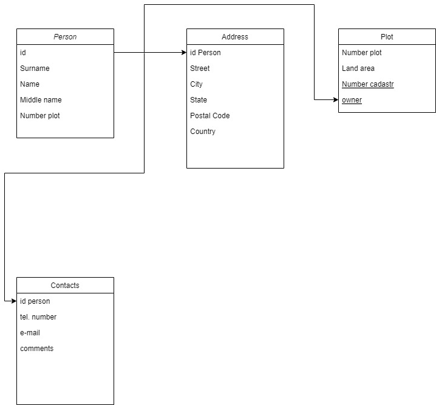

# База данных СНТ
### Разработал Михайлов Артем
## Архитектура проекта
1. Модуль main служит для запуска программы и знакомиться с пользователем
2. Модуль interface служит для взаимодействия с пользователем и описывает возможности базы данных
3. Модуль request_db формирует запросы в БД и выдает результаты запросов.
## Архитектура БД

